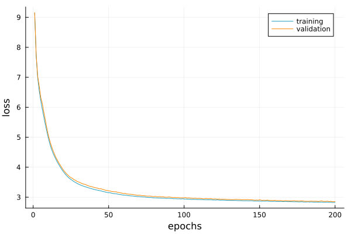

# Example

Let us assume that we have the following data

```@example 1; continued=true
n = 5000

# parameter that is fixed to -1 or 2
θ = Matrix{Float32}(undef, (1, 2*n))
@views θ[1, 1:n] .= -1f0
@views θ[1, (n+1):end] .= 2f0

x1 = randn(2*n)
x2 = sin.(x1/0.8) .+ 0.3*randn(2*n) .+ θ[1, :]
x3 = exp.(x1/1.4)/10 .+  0.1*θ[1, :] .*randn(2*n) .- 0.1 * θ[1, :]
x4 = cos.(x1/1.1) .+ 0.3*randn(2*n) .+ θ[1, :]
x5 = randn(2*n)

x = Float32.(vcat(x1', x2', x3', x4', x5'))
```


We can first define the data as

```@example 1
using DensityFlows

data = DataArrays(x, θ)

ax = CouplingAxes(data)

chain = FlowChain(
    CouplingLayer(data, [1, 2, 3], hidden_dim_s=16,  hidden_dim_t=16), 
    CouplingLayer(data, [3, 4, 5], hidden_dim_s=16,  hidden_dim_t=16), 
    CouplingLayer(data, [5, 1, 2], hidden_dim_s=16,  hidden_dim_t=16), 
    NormalizationLayer(x, -1f0, 1f0)
    )

@summary flow = Flow(chain, data)
```


```julia
state = Optimisers.setup(Optimisers.Adam(1f-4), flow.model)
train!(flow, data, state, epochs=50)
```

```julia
plot(flow.train_loss)
plot!(flow.valid_loss)
```



and the result is

