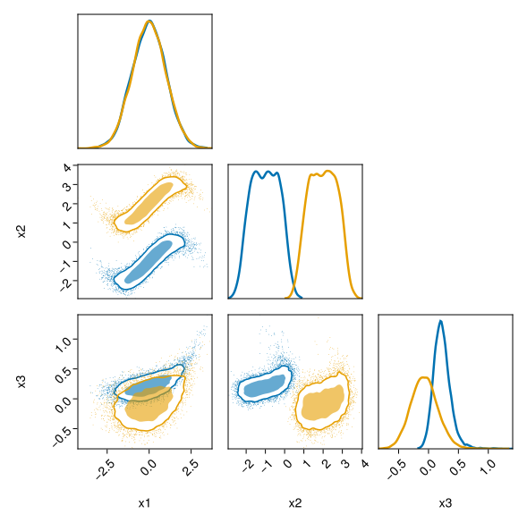

# Manual

## Quick start guide


Let us assume a d-dimensional dataset organised as an `Array{Float32}` called `x` such that `size(x, 1) = d`. Further assume n parameters / conditions gathered into a `Array{Float32}` called `θ` such that `size(θ, 1) = n`. For each `x` corresponds one `θ` and therefore `size(x)[2:end] == size(θ)[2:end]`. If these conditions are satisfied one can find the distribution of $x$ knowing $\theta$ from the following steps.

### Prepare the data

```julia
data = DataArrays(x, θ)
```

### Define the building blocks of the flow

First method is to use the predefined CouplingBlocks, see the [coupling API](./api_coupling.md) for more details. Good practice is to place a `NormalizationLayer` at the end to increase the performances of the network and avoid `NaN`s.

```julia
# create an axis from the x and θ
ax = CouplingAxes(size(x, 1), n=size(θ, 1))

chain = FlowChain(
    CouplingBlock(ax, n_sublayers_s=2, n_sublayers_t=2), 
    CouplingBlock(ax, n_sublayers_s=2, n_sublayers_t=2), 
    CouplingBlock(ax, n_sublayers_s=2, n_sublayers_t=2),
    NormalizationLayer(x, -1f0, 1f0)
    )
```

A second method is to define your chain from `CouplingLayers`. In that case, it is necessary to ensure by hand that all the dimensions are at least acted on by one the layer.

```julia
chain = FlowChain(
    CouplingLayer(3, [1, 2], n=1, n_sublayers_s=2, n_sublayers_t=2), 
    CouplingLayer(3, [2, 3], n=1, n_sublayers_s=2, n_sublayers_t=2), 
    CouplingLayer(3, [3, 1], n=1, n_sublayers_s=2, n_sublayers_t=2), 
    NormalizationLayer(x, -1f0, 1f0)
    )
```


## Example

Let us assume that we have the following data

```@example 1; continued=true
n = 10000

# parameter that is fixed to -1 or 2
θ = Matrix{Float32}(undef, (1, 2*n))
@views θ[1, 1:n] .= -1f0
@views θ[1, (n+1):end] .= 2f0

# 3D data
x1 = randn(2*n)
x2 = sin.(x1/1.1) .+ 0.3*randn(2*n) .+ θ[1, :]
x3 = exp.(x1/1.4)/10 .+  0.1*θ[1, :] .*randn(2*n) .- 0.1 * θ[1, :]

x = Float32.(vcat(x1', x2', x3'))
```


We can first define the data as

```@example 1; continued=true
using DensityFlows

data = DataArrays(x, θ)
ax   = CouplingAxes(3, n=1)
```

Or we can also directly use a coupling Layer

```@example 1

chain = FlowChain(
    CouplingBlock(ax, n_sublayers_s=2, n_sublayers_t=2), 
    CouplingBlock(ax, n_sublayers_s=2, n_sublayers_t=2), 
    CouplingBlock(ax, n_sublayers_s=2, n_sublayers_t=2),
    NormalizationLayer(x, -1f0, 1f0)
    )

@summary flow = Flow(chain, data)
```